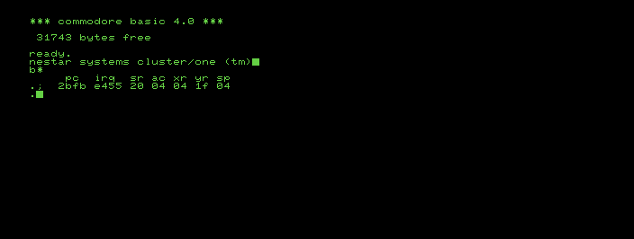

This directory contains the option ROM for the Nestar Systems Cluster/One networking hardware.

The option ROM lives in the $9000 block of ROM. Initialize it by typing `sys 37376` ($9200).

Clients are called "drones," while the server is called the "Queen."

More information here: https://archive.org/details/nestar-systems
